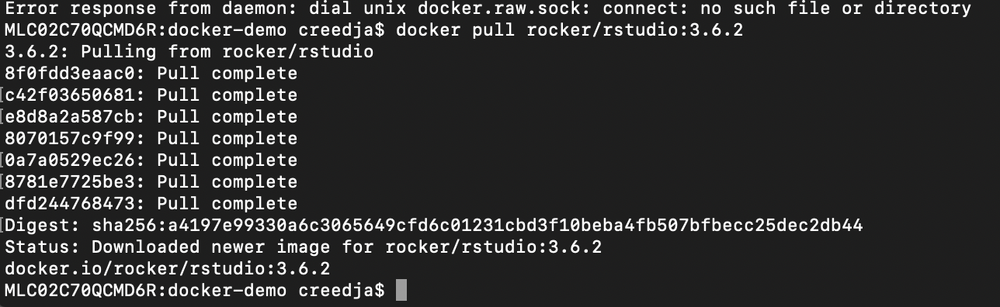
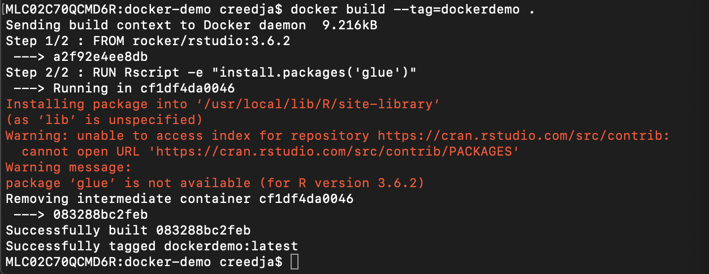
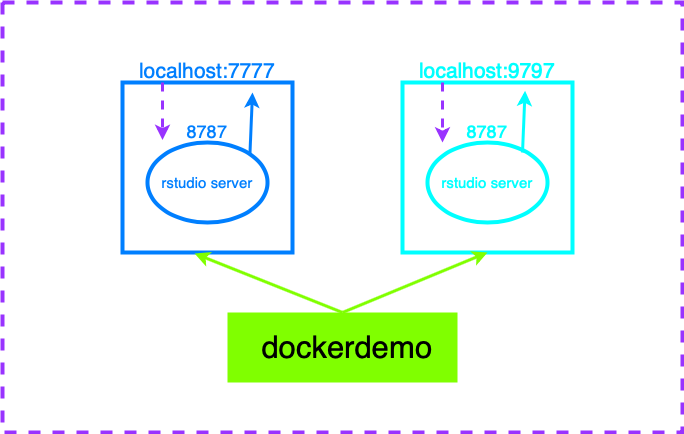

```{r setup, include=FALSE}
knitr::opts_chunk$set(echo = TRUE)
```

## What is Docker

Docker is a tool for creating a bundle of software that includes everything needed to run an application.  When working with docker you will often run into two terms **images** and **containers**. Images are the collection of all the pieces needed to run a software and containes an operating system and any dependencies that an application will use. Containers on the other had are each instance of an image. 

## Getting started 

Before you can start working with docker you first need to install Docker Desktop (https://www.docker.com/products/docker-desktop) and create an account with Docker Hub (https://hub.docker.com). 

**Docker Hub** is similar to github but for docker and containes images that other people/organizations have built that allow you to easily download and get started with docker.

After installing Docker Desktop and creating your account, open up Docker Desktop and log in. 

`r emo::ji("warning")` If you do not have Docker Desktop up, logged in, and running in the background the following steps will not work. 

The **Rocker Project** (https://www.rocker-project.org) provides docker containers for working with R. 

## To the terminal!

So we are going to open up the terminal and create a new folder called docker-demo and then navigate into the folder.

```
mkdir docker-demo
cd docker-demo
```

To pull in an already built rstudio container simply use the command `docker pull` along with the container name `rocker/containername:tag`. 

``` 
docker pull rocker/rstudio:3.6.2
```

<div style="width: 100%; display: flex; align-content: center;">
  <div style="margin: auto;">
  
  </div>
</div>


Looking inside the `rocker/rstudio:3.6.2` container you will see that it starts with `FROM rocker/r-ver:3.6.2`. The **FROM** argument is the starting point of all Dockerfiles and signals to the user what the Dockerfile is building off of. Following that is all the commands that one would type in the terminal to get Rstudio up and running on this "machine". Inside a Dockerfile, you might also see the **COPY** argument which tells the docker to take a local file and include it in the image in a specific location. For example `COPY foo.txt /important_files` would tell docker to take the file `foo.txt` from your local directory and store a copy inside your image in the `important_files` folder. 

**Note** Docker naming convention is follows the pattern creator/image:tag, so in the above example rocker is the creator of the image rstudio is the image and 3.6.2 is the specific tag. You do not need to specify the tag when pulling in an image as the latest will be used, however specifying the tag is good practice, espcially when reproducibility in a concern. 

We are going to write our own dockerdemo that uses the `rcoker/rstudio:3.6.2` container as its basis and then installs some package, specifically `glue`, by performing the following steps.

First we are going to create our new Dockerfile using vim

```
vim dockerfile
```

Inside the Dockerfile we are going to type the following:

```
FROM rocker/rstudio:3.6.2

RUN Rscript -e "install.packages('glue')"
```

Remember the `FROM` arguments specifies the container we will be building our image off of and the `RUN` arguments specifies commands to run inside the image. `Rscript -e` is the current practice for running individual lines of R code from inside the terminal, with th `-e` flag indicating the R expressions to run which are included inside of quotes. 

**Note** once in vim to begin inserting text type `esc` and then `i`. Once you are done typing hit `esc` again followed by `:x` then `enter`. 

Now that we have our docker file we need to build our docker image. To build use the `docker build` command and specify a tag so that the image can be easily identified, for this example the tag will be `dockerdemo` and at the end we need to specify that our Dockerfile is in our current directory by adding a `.` 

```
docker build --tag=dockerdemo .
```

<div style="width: 100%; display: flex; align-content: center;">
  <div style="margin: auto;">
  
  </div>
</div>


To see all of your images you can use `docker images` and to see all of your images that are running currently use `docker ps`. If you ran both of those you would see dockerdemo when using `docker images` but nothing when using `docker ps`. That is because so far we have only built the docker image but are not currently running it. 

To run the docker image type the following 

```
docker run -d -e PASSWORD=arbitrarystring -p 7777:8787 dockerdemo
```

When using `docker run` the `-d` flag stands for detached and runs your container in the  background, the `-e` flag allows you to set environment variables and in this case that is setting your password to some abritrary string. This is required whenever using a rocker container as they connect to the Rstudio server which requires some password. The `-p` flag stands for the ports you are going to use. The first port is your local port and can be any number, the second port is the internal/image port and is determined by the container used to build your image (in this senario the 8787 port was determined by `rocker/rstudio:3.6.2`). These ports are important when accessing your docker image as they tell your computer where to run the image and on what port to leave open for information to come in from. 

To access our rstudio docker image go to your browser of choice and type in 

```
localhost:7777
```
 
or 

```
https://localhost:7777
```

which should take you to the login page for our rstudio docker image! Type rstudio as your username (this is specified in the rstudio container and can be changed but is just extra work for no extra payoff) and use your password that you set with `-e PASSWORD= `. 

You can specify multiple local ports to run multiple containers for the same image.

<div style="width: 100%; display: flex; align-content: center;">
  <div style="margin: auto;">
  
  </div>
</div>
